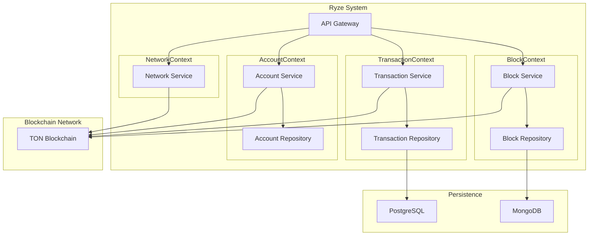

# Ryze

**Ryze** is a blockchain explorer designed to interact with the TON blockchain, allowing users to query and analyze data
related to blocks, transactions, and accounts.

## Project Overview

### 1. Project Goals

Ryze aims to provide an intuitive and efficient platform for interacting with the TON blockchain, offering users the
ability to:

- Query block information.
- Retrieve transaction details.
- Access account data.

### 2. Architecture Overview

Ryze is built on a microservices architecture, adhering to the principles of Domain-Driven Design (DDD). Each major
functional domain is encapsulated as a Bounded Context, implemented as an independent microservice.

### 3. Bounded Contexts Design

We have identified the following Bounded Contexts, each representing a microservice:

#### 3.1 BlockContext

Handles block-related data processing and queries.

- **Key Features**:
    - Retrieve the latest blocks.
    - Fetch block details by ID.

#### 3.2 TransactionContext

Manages transaction-related data processing and queries.

- **Key Features**:
    - Fetch transaction details by ID.
    - Query transactions within a specific block.

#### 3.3 AccountContext

Responsible for account-related data processing and queries.

- **Key Features**:
    - Query account balance.
    - Retrieve account transaction history.

#### 3.4 NetworkContext

Provides real-time status and statistical information about the blockchain network.

- **Key Features**:
    - Overview of network status.
    - Display key statistical data.

### 4. Tech Stack

- **Backend**: Golang
- **Frontend**: React.js or Vue.js (depending on team preference)
- **Database**: PostgreSQL and Redis
- **API**: gRPC (internal communication) and REST (external interface)
- **Containerization**: Docker and Kubernetes
- **Monitoring**: Prometheus and Grafana

### 5. Entities and Interface Design

#### 5.1 BlockContext

```go
type Block struct {
    ID           string
    Height       int64
    Timestamp    time.Time
    Transactions []Transaction
}

type BlockRepository interface {
    GetBlockByID(id string) (*Block, error)
    GetLatestBlocks(limit int) ([]Block, error)
    SaveBlock(block *Block) error
}

```

#### 5.2 TransactionContext

```go
type Transaction struct {
    ID        string
    BlockID   string
    From      string
    To        string
    Amount    float64
    Timestamp time.Time
}

type TransactionRepository interface {
    GetTransactionByID(id string) (*Transaction, error)
    GetTransactionsByBlockID(blockID string) ([]Transaction, error)
    SaveTransaction(transaction *Transaction) error
}
```

### 6. RESTful API Design

#### Block API

- **GET /blocks**: Retrieve a list of the latest blocks.
- **GET /blocks/{id}**: Fetch block details by ID.

#### Transaction API

- **GET /transactions/{id}**: Fetch transaction details by ID.
- **GET /blocks/{blockID}/transactions**: Query transactions within a specified block.

### 7. Development Plan

#### 7.1 Requirements Analysis and Planning

- Finalize detailed requirements and feature list.
- Define user stories and prioritize them.

#### 7.2 Design and Implementation

- Design system architecture and data models.
- Implement each microservice and API.

#### 7.3 Testing and Deployment

- Write unit and integration tests.
- Deploy to development environment for testing.
- Deploy to production using Docker and Kubernetes.

#### 7.4 Monitoring and Operations

- Set up monitoring and logging systems.
- Ongoing maintenance and performance optimization.

### 8. Context Interaction and Dependencies

In a complete system, interactions and dependencies between Bounded Contexts are inevitable. These are typically managed
through events, shared data, API calls, etc. Below are typical interactions within the Ryze system:

1. **BlockContext and TransactionContext**:
    - When a new block is created, BlockContext includes the IDs of all transactions within the block.
      TransactionContext processes these transactions accordingly.
    - Block Service may call Transaction Service to retrieve details of all transactions within a specific block.

2. **TransactionContext and AccountContext**:
    - When a transaction occurs, the `from` and `to` account information affects the account balance, requiring
      AccountContext to update the relevant account data.
    - Account Service may call Transaction Service to obtain the transaction history of a specific account.

3. **NetworkContext and Other Contexts**:
    - NetworkContext provides real-time status and statistical information, which might be utilized by BlockContext,
      TransactionContext, and AccountContext to offer more comprehensive services.

### 9. System Architecture Diagram

The following Mermaid diagram illustrates the relationships and interactions between the various contexts:



- **BlockContext and TransactionContext**:
    - Block Service includes transaction IDs from Transaction Service (`Contains`).
- **TransactionContext and AccountContext**:
    - Transaction Service updates account data in Account Service (`Updates`).
- **NetworkContext and Other Contexts**:
    - Network Service provides network status and statistical information to Block Service, Transaction Service, and
      Account Service (`Provides stats to`).

This diagram helps to better understand the data flow and dependencies within the system.
